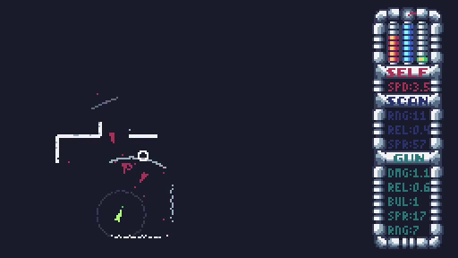
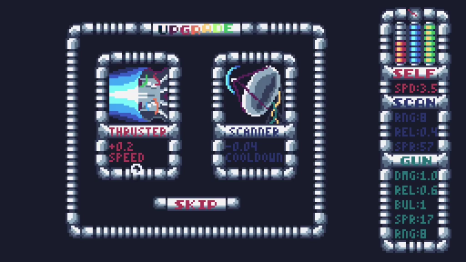
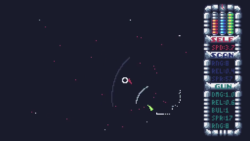

### LiDAR Dungeon


Fight enemies and collect upgrades as you traverse the depths of a procedurally-generated spaceship, seeing only that which your LiDAR reveals.

It can be played online [here](https://wojciech-graj.itch.io/lidar-dungeon), although dowloading the game will provide a better gaming experience. Downloads can be found in the releases sidebar.

Made in 7 days using the TIC-80 for the [7DRL2023](https://itch.io/jam/7drl-challenge-2023) GameJam.

Requires Mouse/Touchpad + Keyboard to play. Controls can be remapped by pressing ESC, then navigating to options. Press Z to toggle music.

### Screenshots




### Credits
- Development: Wojciech Graj
- Testing: Jan Czajka
- Testing: Yahor Dauksha

### License
```
    Copyright (C) 2023  Wojciech Graj

    This program is free software: you can redistribute it and/or modify
    it under the terms of the GNU Affero General Public License as published by
    the Free Software Foundation, either version 3 of the License, or
    (at your option) any later version.

    This program is distributed in the hope that it will be useful,
    but WITHOUT ANY WARRANTY; without even the implied warranty of
    MERCHANTABILITY or FITNESS FOR A PARTICULAR PURPOSE.  See the
    GNU Affero General Public License for more details.

    You should have received a copy of the GNU Affero General Public License
    along with this program.  If not, see <https://www.gnu.org/licenses/>.
```
