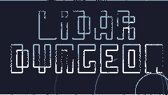

### LiDAR Dungeon


Fight enemies and collect upgrades as you traverse the depths of a procedurally-generated spaceship, seeing only that which your LiDAR reveals.

It can be played online [here](https://wojciech-graj.itch.io/lidar-dungeon), although dowloading the game will provide a better gaming experience. Executable downloads can be found [here](https://wojciech-graj.itch.io/lidar-dungeon).

Made in 7 days using the TIC-80 for the [7DRL2023](https://itch.io/jam/7drl-challenge-2023) GameJam.

Requires Mouse/Touchpad + Keyboard to play. Controls can be remapped by pressing ESC, then navigating to options. Press Z to toggle music.

### Screenshots


### Credits
- Development: Wojciech Graj
- Testing: Jan Czajka
- Testing: Yahor Dauksha

### Technical Curiosities

#### Map Generation

Top-down 2D videogames typically either have a camera that follows the player in a smooth motion, or is fixed and shows a single "screen" at a time. With a following camera, movement is typically conveyed by having the map scroll while the player remains mostly stationary. Given how little of the map is visible, as the player only sees what they scan with their LiDAR, they would have very little context showing this movement, and would likely feel disoriented. As such, the map was split into 25x17 tile screens, with only the player's current screen being displayed.


###### Room Placement

Roguelikes are supposed to be difficult but fair, such that the player can only blame their death on their own mistakes or poor decision making. To apply this to the game's core mechanic, combat, it was important for all enemies to be visible to the player as soon as they spawn so the player doesn't feel cheated by being shot by an offscreen enemy that they couldn't have accounted for. Given the above decision to split the map into distinct screens, the best way to ensure that all combat encounters were contained to a single screen was to generate rooms within then bounds of these screens, such that no room could span numerous screens.

The first step in the game's map generation is deciding on the locations of rooms on each screen. This is done by providing the bounds of the empty area, initially the edges of the screen, and placing a room of a bounded random size somewhere within that area. The remaining free space around the room is subdivided into four rectangles as shown in the illustration, and the above procedure is repeated for each one until all the free areas are too small to house a room. In the illustration, rectangles 2,3 were larger than 4,5 because vertical cuts were used to split the area, but the game's algorithm decides whether to make vertical or horizontal cuts by attempting to maximize the size of the largest area created by the cuts, as to increase the probability of another room being able to fit inside.

```
111111111   334442222   334446666   334446666   334447###
111111111   33###2222   33###6666   33###6666   33###7# #
111111111   33# #2222   33# #6666   33# #6666   33# #7# #
111111111 > 33###2222 > 33####### > 33####### > 33#######
111111111   335552222   33555#  #   33####  #   33####  #
111111111   335552222   33555#  #   33# ##  #   33# ##  #
111111111   335552222   33555####   33#######   33#######
```

###### Tunneling

After the rooms are placed, they have to be connected to eachother. Rogue implements tunneling by picking two adjacent rooms, sending a straight tunnel out of each one, and adding a bend at the point at which they align such that they meet. Here, however, rooms are very tightly packed and there simply isn't enough space for such an approach. Instead, each room's wall has a random chance of sending out a tunnel from some point along it, which stops once it encounters another room, tunnel, or the edge of the map. The tunnel also has a small chance of meandering perpendicular to the direction in which it is moving by 1 tile. The tunnels' randomized locations and meandering make them very unpredictable, thereby making traversal more interesting for the player.

###### Verification

The above approach to tunneling is very likely to produce a map in which all rooms can be reached from any other room if the total area occupied by the map is a rectangle, as each room will have between 2-4 chances (depending on whether or not it is in a corner/edge) to send out a tunnel that will likely connect it to another room. However this isn't guaranteed, so a flood-fill is performed, starting with a random location in a random room. As long as the number of unfilled rooms is low, the unfilled rooms can simply be removed, or their tunneling can be re-tried.

This approach works well but is rather inefficient, and verification could instead be done by keeping track of sets of connected rooms during tunneling.

### License
```
    Copyright (C) 2023  Wojciech Graj

    This program is free software: you can redistribute it and/or modify
    it under the terms of the GNU Affero General Public License as published by
    the Free Software Foundation, either version 3 of the License, or
    (at your option) any later version.

    This program is distributed in the hope that it will be useful,
    but WITHOUT ANY WARRANTY; without even the implied warranty of
    MERCHANTABILITY or FITNESS FOR A PARTICULAR PURPOSE.  See the
    GNU Affero General Public License for more details.

    You should have received a copy of the GNU Affero General Public License
    along with this program.  If not, see <https://www.gnu.org/licenses/>.
```
